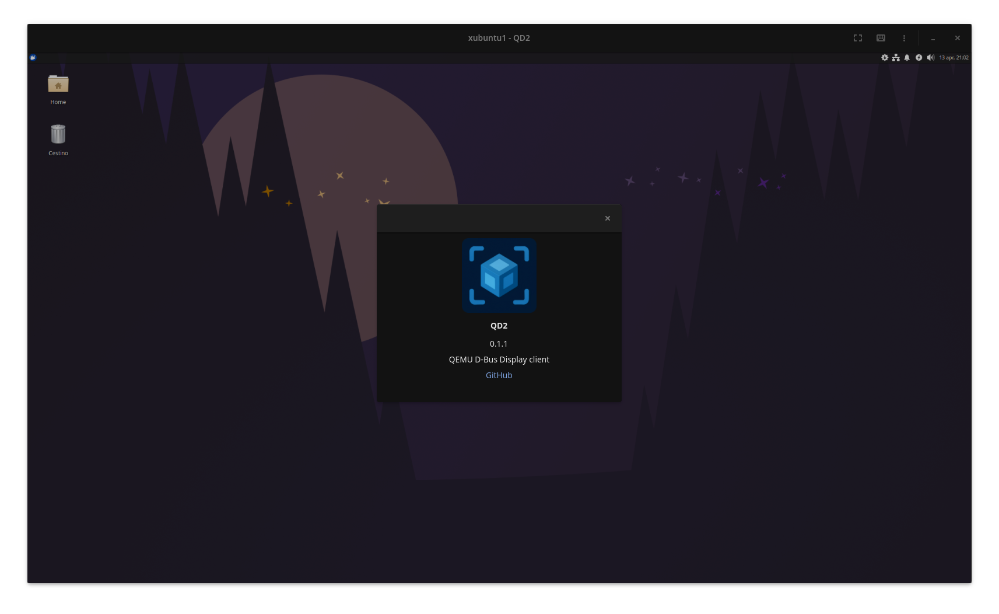

<p align="center">
  
</p>

<p align="center">
  <strong>QD2</strong><br>
  QD2 (QEMU D-Bus Display) is a modern Rust + GTK4 client for discovering, inspecting, diagnosing, and connecting to QEMU virtual machines exposed through <code>-display dbus</code>.
</p>

<p align="center">
  <code>list</code> • <code>inspect</code> • <code>doctor</code> • <code>connect</code> • <code>version</code>
</p>

QD2 is built for people who want the flexibility of QEMU's D-Bus display stack without giving up a polished desktop viewer. It combines a CLI that is useful for scripting and debugging with a GTK4 frontend that handles real-world VM workflows like framebuffer rendering, DMABUF scanouts, input grab, clipboard sync, audio playback, and diagnostics.



## ✨ Why QD2

- Discover QEMU D-Bus VMs on the session bus and common libvirt private socket locations.
- Inspect consoles, exported interfaces, chardevs, clipboard exposure, and audio exposure.
- Diagnose common host and guest setup problems with `qd2 doctor`.
- Connect to a console with GTK4, keyboard and mouse forwarding, guest cursor updates, fullscreen controls, guest shortcut injection, screenshots, audio, and clipboard integration.
- Recover more gracefully from disconnects and VM restarts instead of failing silently.
- Tune the viewer with custom hotkeys and targeted runtime diagnostics.

## 🚀 Commands

| Command | Purpose | Example |
| --- | --- | --- |
| `qd2 list` | Enumerate visible QEMU D-Bus VMs. | `qd2 list` |
| `qd2 inspect` | Print VM metadata, consoles, chardevs, and exported helper objects. | `qd2 inspect --vm demo-vm` |
| `qd2 doctor` | Check the host environment and report likely VM-side wiring issues. | `qd2 doctor --vm demo-vm` |
| `qd2 connect` | Open the GTK4 viewer for one console. | `qd2 connect --fullscreen --address "unix:path=<path_to_sock>"` |
| `qd2 version` | Print the QD2 version from the Cargo package metadata. | `qd2 version` |

## 🛠️ Common Options

| Option | Purpose | Example |
| --- | --- | --- |
| `--address <DBUS_ADDRESS>` | Target a specific private D-Bus socket instead of auto-discovery. | `qd2 inspect --address "unix:path=<path_to_sock>"` |
| `--verbose` | Print extra discovery and viewer diagnostics. | `qd2 --verbose doctor` |
| `--fullscreen` | Start the GTK4 viewer directly in fullscreen mode for `connect`. | `qd2 connect --fullscreen` |
| `--undecorated` | Open the GTK4 viewer without normal window decorations for `connect`. | `qd2 connect --undecorated` |
| `--hotkeys ...` | Override viewer shortcuts in a virt-viewer-style format for `connect`. | `qd2 connect --hotkeys "toggle-fullscreen=ctrl+enter,release-cursor=ctrl+alt"` |

## 🖥️ Viewer Highlights

- Software and DMABUF-backed display rendering.
- Keyboard and mouse forwarding with grab and release behavior.
- Guest cursor shape and visibility updates.
- Clipboard sync for text, HTML, URI lists, images, and primary selection support where available.
- Guest audio playback through the QEMU D-Bus audio interface.
- Floating fullscreen controls inspired by virt-viewer.
- Direct fullscreen launch with `qd2 connect --fullscreen`.
- Optional undecorated launch mode for tiling compositor workflows.
- Top-bar actions for taking screenshots and sending guest shortcuts like `Ctrl+Alt+Delete`.
- Configurable hotkeys for fullscreen, grab release, and DMABUF transforms.
- A VM chooser for the multi-VM `connect` flow.

## 🧱 Install Requirements

You can either download a prebuilt binary from the [GitHub Releases](https://github.com/thelicato/qd2/releases) page or build QD2 from source.

Linux releases also ship native `.deb` and `.rpm` packages. Those packages install the `qd2` binary, the application icon, and a desktop launcher that starts `qd2 connect`.

Building from source currently requires:

- Rust stable with Cargo
- GTK4 development files
- pixman development files
- usbredir 0.13+ libraries visible to `pkg-config` (`libusbredirhost.pc` and `libusbredirparser-0.5.pc`)
- `pkg-config` or `pkgconf`

Typical package names:

- Debian/Ubuntu: `libgtk-4-dev`, `libpixman-1-dev`, `libusb-1.0-0-dev`, `pkg-config`, `meson`, `ninja-build`

If your distro packages do not provide the `usbredir` pkg-config files expected by `qemu-display`, install `usbredir` 0.13+ from source before building QD2.

Build from source with:

```bash
cargo build --release
```

Install packaged Linux builds with your system package manager:

```bash
sudo dpkg -i qd2_*.deb
sudo rpm -i qd2-*.rpm
```

## ⚙️ Runtime Requirements

QD2 expects a QEMU VM exposed through `-display dbus`, either on the session bus or on a private D-Bus socket passed with `--address`.

At runtime, the most important pieces are:

- A QEMU build with D-Bus display support
- A guest with a supported display device and an exported QEMU D-Bus console
- Access to the D-Bus socket you want to connect to
- A working desktop session for GTK4 rendering

Some features have extra requirements:

- Clipboard sync usually needs `-chardev qemu-vdagent,...,clipboard=on` and a `virtserialport` named `com.redhat.spice.0`
- Audio playback works best when QD2 runs inside the same user session as PipeWire or PulseAudio
- DMABUF scanout import is currently Linux-specific and depends on the host GTK stack and GPU/render node support
- Private libvirt sockets often require ACLs or group membership if you want to run QD2 without `sudo`

## 📋 Clipboard Setup

If `qd2 connect` works but copy and paste do not, the missing piece is usually the guest-agent channel, not QD2 itself.

For plain QEMU, add a `qemu-vdagent` chardev plus a matching virtio serial port:

```bash
-chardev qemu-vdagent,id=charchannel1,name=vdagent,clipboard=on \
-device '{"driver":"virtserialport","bus":"virtio-serial0.0","nr":2,"chardev":"charchannel1","id":"channel1","name":"com.redhat.spice.0"}'
```

That is the same shape QD2 expects when it inspects clipboard support.

For libvirt or `virt-manager`, the equivalent XML is a `qemu-vdagent` channel. If the UI does not expose it directly, open the XML editor and add:

```xml
<channel type='qemu-vdagent'>
  <source>
    <clipboard copypaste='yes'/>
  </source>
  <target type='virtio' name='com.redhat.spice.0'/>
</channel>
```

Inside the guest:

- X11 desktops usually need the regular `spice-vdagent` session agent running.
- Wayland guests, especially Hyprland or wlroots-based sessions, may need a Wayland-native guest agent instead of the traditional X11-focused `spice-vdagent`.

For Wayland guests, see [`paprika-vdagent`](https://github.com/thelicato/paprika-vdagent), a standalone Wayland SPICE guest agent that was built specifically for clipboard support without relying on X11 clipboard mirroring.

When clipboard still does not work, `qd2 inspect` and `qd2 doctor` are the quickest way to confirm whether QEMU is exporting both the D-Bus clipboard object and the guest-agent channel.

## 🌍 Platform Notes

- Release artifacts are produced for Linux on both `x86_64` and `arm64`.
- `qd2 connect` currently targets Linux environments.
- DMABUF import is currently available on Linux GTK builds.
- Some host integrations, especially Wayland, PipeWire, and private libvirt sockets, depend on the runtime session and permissions you launch QD2 with.

## ⚠️ Known Limitations

- The viewer is Linux-only.
- DMABUF acceleration depends on the host Linux GTK stack and render node support.
- Running QD2 under `sudo` can break desktop integrations like audio or clipboard unless the relevant user-session environment is preserved.
- Some guest features depend on the VM configuration, not just QD2 itself; clipboard and audio both require the right QEMU-side wiring.
- Support is focused on a single interactive viewer window per `connect` session rather than advanced management features like USB redirection or file transfer.

## 📦 Releases

Prebuilt binaries are published on the [GitHub Releases](https://github.com/thelicato/qd2/releases) page.

Each release includes:

- packaged binaries for Linux on both `x86_64` and `arm64`
- Linux `.deb` and `.rpm` packages with the desktop launcher and icon included
- release notes generated with `npx changelogithub`
- a `SHA256SUMS.txt` file for checksum verification

## 🤝 Contributing

Bug reports and pull requests are welcome.

- Read the contribution guide in [CONTRIBUTING.md](./CONTRIBUTING.md)
- Use the GitHub issue forms for bug reports and feature requests so the right diagnostics and VM details are captured up front

## 🧭 Structure

| File | Purpose |
| --- | --- |
| `cli.rs` | Defines the command-line interface, subcommands, and flags. |
| `diagnostics.rs` | Implements `doctor`, verbose logging, and host-side environment checks. |
| `main.rs` | Wires the CLI to discovery, inspection, diagnostics, and the viewer entry point. |
| `qemu/mod.rs` | Re-exports the QEMU D-Bus domain API from smaller discovery, inspection, and warning modules. |
| `qemu/discovery.rs` | Discovers QEMU D-Bus VMs, opens connections, and scans libvirt socket locations. |
| `qemu/inspection.rs` | Builds inspection reports and resolves the final console connection target. |
| `qemu/selection.rs` | Selects VMs and consoles from discovery results and formats selection errors. |
| `qemu/types.rs` | Defines the shared QEMU discovery, inspection, and connect-target data structures. |
| `qemu/warnings.rs` | Derives clipboard/audio inspection warnings from exported QEMU objects. |
| `viewer/mod.rs` | Orchestrates the GTK4 viewer window, event loop, and presentation updates. |
| `viewer/audio.rs` | Registers QEMU audio listeners and forwards guest playback to host audio backends. |
| `viewer/chrome.rs` | Builds the titlebar, fullscreen controls, shortcuts dialog, and about dialog. |
| `viewer/chooser.rs` | Shows the VM selection window when `connect` sees more than one possible target. |
| `viewer/clipboard.rs` | Bridges GTK clipboard state and the QEMU clipboard protocol in both directions. |
| `viewer/cursor.rs` | Tracks guest cursor shape and visibility and applies them to the viewer. |
| `viewer/dmabuf.rs` | Imports, transforms, and presents DMABUF scanouts for accelerated rendering. |
| `viewer/events.rs` | Couples viewer events with a GTK wakeup source so frame updates reach the UI promptly. |
| `viewer/framebuffer.rs` | Normalizes software framebuffer updates and emits presentation events. |
| `viewer/grab.rs` | Manages keyboard and mouse capture, release, and cursor grabbing behavior. |
| `viewer/hotkeys.rs` | Parses configurable hotkey definitions and matches them at runtime. |
| `viewer/keyboard.rs` | Translates GTK key events into QEMU qnum keycodes and forwards them to the guest. |
| `viewer/listener/mod.rs` | Supervises the background listener thread and the lifetime of one viewer session. |
| `viewer/listener/remote.rs` | Talks to the remote QEMU console and exports the local D-Bus listener objects. |
| `viewer/listener/session.rs` | Runs one connected console session, including input, clipboard, audio, and disconnect handling. |
| `viewer/mouse.rs` | Maps widget coordinates and pointer events into guest mouse actions. |
| `viewer/utils.rs` | Holds shared viewer helpers for sizing, icons, and small GTK utilities. |

## 📚 References

- QEMU D-Bus display documentation: <https://www.qemu.org/docs/master/interop/dbus-display.html>
- `qemu-display` Rust crate: <https://gitlab.com/marcandre.lureau/qemu-display>

## 🪪 License

*QD2* is released under the [GPL-3.0 LICENSE](./LICENSE)
